# Pengelompokan Wilayah Distribusi & Klasifikasi Kualitas Biji Kopi
### Menggunakan K-Means Clustering dan Naive Bayes Classification


---

## 📌 Deskripsi Proyek

Proyek ini adalah pipeline pembelajaran mesin (*machine learning*) lengkap untuk analisis dan penentuan kualitas biji kopi melalui pemrosesan citra digital (*digital image processing*). Proyek ini menggabungkan dua metode utama:
1. **Unsupervised Learning (K-Means Clustering)**: Mengelompokkan wilayah distribusi biji kopi berdasarkan kesamaan fitur visual seperti warna (RGB/HSV), histogram, dan tekstur GLCM (*Grey-Level Co-occurrence Matrix*).
2. **Supervised Learning (Gaussian Naive Bayes)**: Mengklasifikasikan kualitas biji kopi berdasarkan label kelompok/wilayah distribusi yang dihasilkan oleh algoritma clustering.

Dataset yang digunakan terdiri dari **1.913 gambar biji kopi** yang terbagi ke dalam 3 varietas: **Arabika** (633), **Liberika** (639), dan **Robusta** (641).

---

## 🚀 Fitur Utama & Pembaruan Terkini

* **Segmentasi Citra & Auto-Cropping Presisi**: Memotong (*cropping*) latar belakang putih studio secara otomatis untuk mengisolasi biji kopi di tengah gambar. Menggunakan deteksi background dinamis dari 4 sudut gambar untuk toleransi variasi pencahayaan, serta pemotongan area tengah 22% secara presisi untuk menjamin tingkat perbesaran biji kopi **sama rata (konsisten/seragam)** di seluruh visualisasi.
* **Visualisasi Bar Chart dengan Tumpukan Gambar Biji Kopi Asli**: Mengubah representasi batang grafik (*bar chart*) konvensional menjadi tumpukan (*stack*) gambar biji kopi asli tanpa distorsi aspek rasio (*no stretching*). Sumbu Y merepresentasikan jumlah data melalui jumlah tumpukan biji kopi.
* **Ekstraksi Multi-Fitur Lengkap (112 Dimensi)**:
  * Statistik Warna (Mean & Standard Deviation pada ruang warna RGB dan HSV).
  * Histogram Warna (32-bin per channel).
  * Tekstur GLCM (Kontras, Energi, Homogenitas, Dissimilarity).
* **Data Cleaning & Outlier Removal**: Pembersihan data pencilan menggunakan metode Z-score (threshold $Z > 3.5$) untuk memastikan akurasi pengelompokan K-Means.
* **14+ Visualisasi Statistik**: Mulai dari kurva Elbow, analisis Silhouette per sampel, PCA scatter plot 2D, radar chart profil fitur, hingga heatmap korelasi.
* **Batch Prediksi Semua Gambar & Ekspor Excel**: `predict.py` sekarang dapat memproses seluruh folder atau keyword `all`, lalu menyimpan hasil prediksi ke `outputs/predictions.xlsx`.

---

## 🧠 Pembahasan Teoretis & Eksplorasi Matematis Algoritma

### 1. Ekstraksi Fitur Citra Digital

Untuk mengonversi gambar biji kopi menjadi representasi data numerik, sistem mengekstraksi 112 fitur yang mencakup aspek warna dan tekstur:

#### A. Statistik Warna RGB & HSV (12 Fitur)
Untuk setiap saluran warna $c \in \{R, G, B, H, S, V\}$, dihitung nilai rata-rata ($\mu_c$) dan standar deviasi ($\sigma_c$) dari $P$ piksel penyusun citra:
$$\mu_c = \frac{1}{P}\sum_{i=1}^{P} I_c(i), \quad \sigma_c = \sqrt{\frac{1}{P}\sum_{i=1}^{P} (I_c(i) - \mu_c)^2}$$

#### B. Histogram Warna (96 Fitur)
Histogram warna 32-bin dihitung secara independen untuk saluran R, G, dan B. Histogram merepresentasikan distribusi probabilitas diskret frekuensi intensitas warna:
$$H_c(b) = \sum_{i=1}^{P} \delta(f(I_c(i)) - b), \quad b \in \{0, 1, \dots, 31\}$$
di mana $f(I_c(i))$ adalah fungsi pemetaan intensitas piksel $0\text{-}255$ ke indeks bin $0\text{-}31$, dan $\delta$ adalah fungsi Kronecker delta.

#### C. Fitur Tekstur GLCM (4 Fitur)
*Grey-Level Co-occurrence Matrix* (GLCM) mengukur hubungan spasial piksel bertetangga berdasarkan matriks probabilitas transisi tingkat keabuan $P(i,j)$ dengan jarak spasial $d=1$ dan sudut orientasi $\theta \in \{0, \frac{\pi}{4}, \frac{\pi}{2}, \frac{3\pi}{4}\}$:
*   **Contrast** (Mengukur derajat variasi intensitas lokal):
    $$\text{Contrast} = \sum_{i,j} |i-j|^2 P(i,j)$$
*   **Energy / Angular Second Moment** (Mengukur derajat homogenitas/keteraturan tekstur global):
    $$\text{Energy} = \sqrt{\sum_{i,j} P(i,j)^2}$$
*   **Homogeneity / Inverse Difference Moment** (Mengukur kedekatan sebaran elemen GLCM ke diagonal utama):
    $$\text{Homogeneity} = \sum_{i,j} \frac{P(i,j)}{1 + |i-j|}$$
*   **Dissimilarity** (Mengukur derajat linearitas perbedaan intensitas piksel tetangga):
    $$\text{Dissimilarity} = \sum_{i,j} |i-j| P(i,j)$$

---

### 2. K-Means Clustering (Unsupervised Learning)

Algoritma K-Means mempartisi $N$ sampel data $\mathbf{X} = \{\mathbf{x}_1, \mathbf{x}_2, \dots, \mathbf{x}_N\} \subset \mathbb{R}^{d}$ (di mana $d = 112$ dimensi) ke dalam $K$ buah kelompok $\mathbf{S} = \{S_1, S_2, \dots, S_K\}$ secara iteratif.

#### A. Objektif Optimasi
Matriks centroid optimal $\mathbf{M} = \{\boldsymbol{\mu}_1, \boldsymbol{\mu}_2, \dots, \boldsymbol{\mu}_K\}$ ditentukan dengan meminimalkan *Within-Cluster Sum of Squares* (WCSS) atau inersia:

$$\arg\min_{\mathbf{S}} \sum_{j=1}^{K} \sum_{\mathbf{x}_i \in S_j} \|\mathbf{x}_i - \boldsymbol{\mu}_j\|^2$$

di mana:
$$\boldsymbol{\mu}_j = \frac{1}{|S_j|} \sum_{\mathbf{x}_i \in S_j} \mathbf{x}_i$$

#### B. Algoritma Iteratif (Lloyd's Algorithm)
1.  **Inisialisasi**: Memilih $K$ centroid awal secara acak menggunakan metode inisialisasi cerdas `k-means++` untuk mempercepat konvergensi.
2.  **Assignment Step**: Memasukkan setiap sampel data $\mathbf{x}_i$ ke cluster $S_j^{(t)}$ dengan jarak Euclidean terdekat:
    $$S_j^{(t)} = \left\{ \mathbf{x}_i : \|\mathbf{x}_i - \boldsymbol{\mu}_j^{(t)}\|^2 \le \|\mathbf{x}_i - \boldsymbol{\mu}_{j^*}^{(t)}\|^2 \quad \forall j^* \in \{1, \dots, K\} \right\}$$
3.  **Update Step**: Menghitung ulang koordinat centroid baru sebagai rata-rata geometris dari semua titik anggota cluster tersebut:
    $$\boldsymbol{\mu}_j^{(t+1)} = \frac{1}{|S_j^{(t)}|} \sum_{\mathbf{x}_i \in S_j^{(t)}} \mathbf{x}_i$$
4.  **Konvergensi**: Iterasi dihentikan apabila $\boldsymbol{\mu}_j^{(t+1)} = \boldsymbol{\mu}_j^{(t)}$ atau ketika batas maksimum iterasi (300) tercapai.

#### C. Kriteria Evaluasi Silhouette Coefficient
Untuk mengukur seberapa baik pemisahan dan kerapatan cluster, digunakan koefisien siluet per sampel $s(i)$:

$$s(i) = \frac{b(i) - a(i)}{\max(a(i), b(i))}$$

di mana:
*   $a(i) = \frac{1}{|S_I| - 1} \sum_{j \in S_I, j \neq i} d(i, j)$ (rata-rata jarak sampel $i$ ke seluruh sampel lain di dalam cluster-nya sendiri $S_I$).
*   $b(i) = \min_{J \neq I} \frac{1}{|S_J|} \sum_{j \in S_J} d(i, j)$ (rata-rata jarak minimum sampel $i$ ke seluruh sampel di cluster terdekat lainnya $S_J$).
*   Skor berkisar $[-1, 1]$. Nilai mendekati $1$ menunjukkan klasifikasi kelompok yang sangat baik dan tegas.

---

### 3. Gaussian Naive Bayes Classification (Supervised Learning)

Model Gaussian Naive Bayes digunakan untuk mengklasifikasikan varietas/kualitas biji kopi berdasarkan probabilitas posterior dari 112 fitur citra kontinu.

#### A. Teorema Bayes & Asumsi Independensi Kondisional
Berdasarkan Teorema Bayes, probabilitas bersyarat bahwa sampel $\mathbf{x}$ termasuk ke dalam kelas $C_k$ (dimana $k \in \{0, 1, \dots, 7\}$) dirumuskan sebagai:

$$P(C_k \mid \mathbf{x}) = \frac{P(C_k) \cdot P(\mathbf{x} \mid C_k)}{P(\mathbf{x})}$$

Dengan asumsi *Naive* (independensi bersyarat yang menganggap setiap fitur $x_i$ tidak saling mempengaruhi jika diketahui kelasnya $C_k$), maka probabilitas *joint likelihood* disederhanakan menjadi perkalian probabilitas marginal:

$$P(\mathbf{x} \mid C_k) = \prod_{i=1}^{d} P(x_i \mid C_k)$$

Substitusi persamaan ini ke Teorema Bayes menghasilkan pengklasifikasi Maximum A Posteriori (MAP) berikut:

$$\hat{y} = \arg\max_{k \in \{0, \dots, 7\}} P(C_k) \prod_{i=1}^{d} P(x_i \mid C_k)$$

#### B. Densitas Peluang Gaussian (Likelihood Kontinu)
Karena fitur citra kontinu, sebaran fiturnya diasumsikan mengikuti distribusi normal (Gaussian). Probabilitas likelihood $P(x_i \mid C_k)$ diformulasikan sebagai:

$$P(x_i \mid C_k) = \frac{1}{\sqrt{2\pi\sigma_{k,i}^2}} \exp\left( -\frac{(x_i - \mu_{k,i})^2}{2\sigma_{k,i}^2} \right)$$

Di mana:
*   $\mu_{k,i}$ melambangkan rata-rata fitur ke-$i$ di dalam sampel kelas $C_k$.
*   $\sigma_{k,i}^2$ melambangkan varians fitur ke-$i$ di dalam sampel kelas $C_k$.
*   Untuk menghindari kalkulasi pembagian dengan nol ketika nilai varians bernilai sangat kecil (mendekati nol), sistem menambahkan nilai epsilon kecil (variance smoothing): $\sigma_{k,i}^2 \leftarrow \sigma_{k,i}^2 + \epsilon \cdot \sigma_{\text{max}}^2$.

#### C. Mengapa Model Ini Sangat Efektif di Sini?
Meskipun asumsi independensi fitur (*naive assumption*) jarang terpenuhi secara murni di dunia nyata, model ini sangat tangguh dalam menangani data citra ekstraksi fitur karena distribusi warna (RGB/HSV) per cluster sangat dominan mengikuti bentuk lonceng normal. Selain itu, kecepatan training-nya sangat tinggi karena parameter $\mu$ dan $\sigma^2$ dapat dihitung secara analitik langsung dalam satu kali komputasi (*single pass*) tanpa memerlukan kalkulasi optimasi iteratif.

---

## 📁 Struktur Proyek

```
kopi_clustering_classification/
│
├── dataset/
│   ├── raw/
│   │   ├── coffee_images/
│   │   │   ├── arabika/         (633 gambar)
│   │   │   ├── liberika/        (639 gambar)
│   │   │   └── robusta/         (641 gambar)
│   │   ├── coffee_quality.csv
│   │   └── distribution_region.csv
│   │
│   └── processed/
│       ├── features_extracted.csv
│       ├── features_scaled.csv
│       └── labeled_dataset.csv
│
├── src/
│   ├── __init__.py
│   ├── data_loader.py           # Membaca gambar & CSV metadata
│   ├── image_preprocessing.py   # Resize, blur, konversi warna, normalisasi
│   ├── feature_extraction.py    # Statistik warna, histogram, GLCM
│   ├── kmeans_model.py          # Scaling, Z-score outlier removal, K-Means
│   ├── naive_bayes_model.py     # Gaussian Naive Bayes + Stratified K-Fold
│   ├── evaluation.py            # Silhouette, akurasi, confusion matrix
│   └── visualization.py         # Visualisasi plot (tumpukan biji kopi, dll)
│
├── models/
│   ├── kmeans_model.pkl
│   ├── naive_bayes_model.pkl
│   └── scaler.pkl
│
├── outputs/
│   ├── plots/                   # 14+ Visualisasi PNG hasil training
│   ├── clustering_report.txt    # Laporan metrik K-Means
│   └── classification_report.txt# Laporan metrik Naive Bayes
│
├── config.py                    # Parameter & path global proyek
├── main.py                      # Script utama untuk menjalankan pipeline
├── test_warna.py                # Script uji coba ekstraksi warna & cropping
└── requirements.txt             # Dependensi pustaka Python
```

---

## 🖼️ Semua Visualisasi Hasil Pipeline (`outputs/plots/`)

Berikut adalah seluruh grafik visualisasi statistik yang dihasilkan secara otomatis dan disimpan di folder `outputs/plots/`:

### 1. Ukuran Wilayah Distribusi (Tumpukan Biji Kopi Asli)
Menampilkan jumlah data di setiap cluster dalam bentuk **tumpukan biji kopi asli** yang dipotong seragam (*sama rata*). Visualisasi ini juga menampilkan proporsi persentase di sebelah kanan.

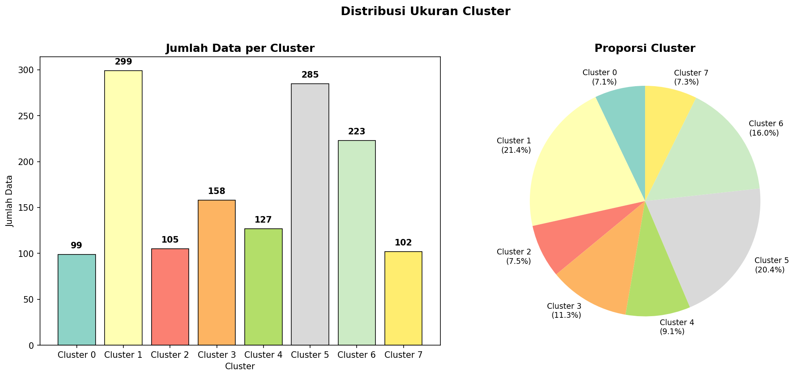

### 2. Kurva Elbow (Penentuan Nilai K Optimal)
Menentukan nilai $K$ optimal berdasarkan perbandingan nilai inersia (WCSS) dari K=2 hingga K=10. Siku kurva mulai landai pada K=8.

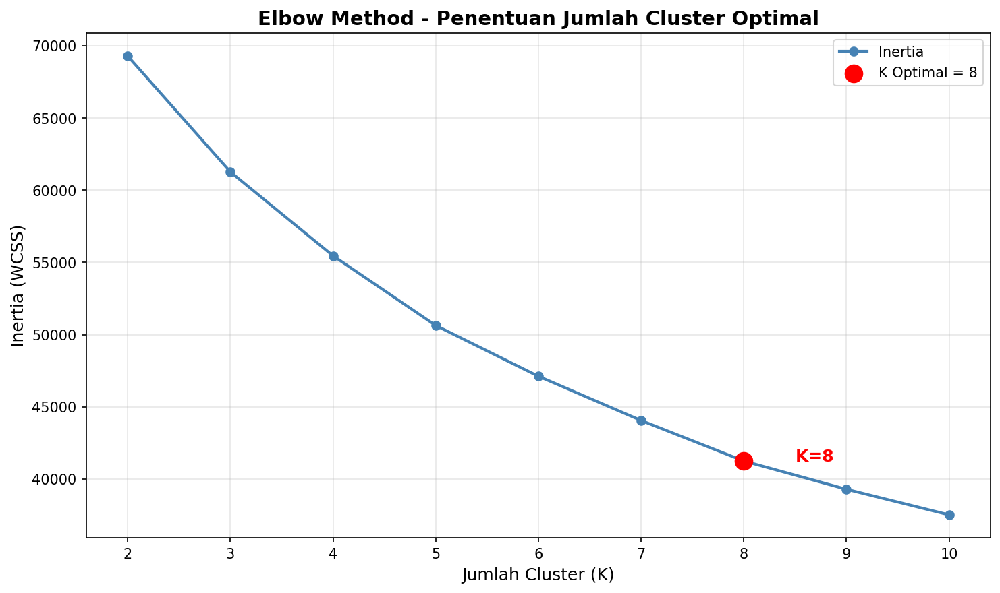

### 3. Nilai Silhouette Rata-rata per K
Mengevaluasi kerapatan dan pemisahan antar-cluster untuk tiap K. Membantu mengonfirmasi K optimal.

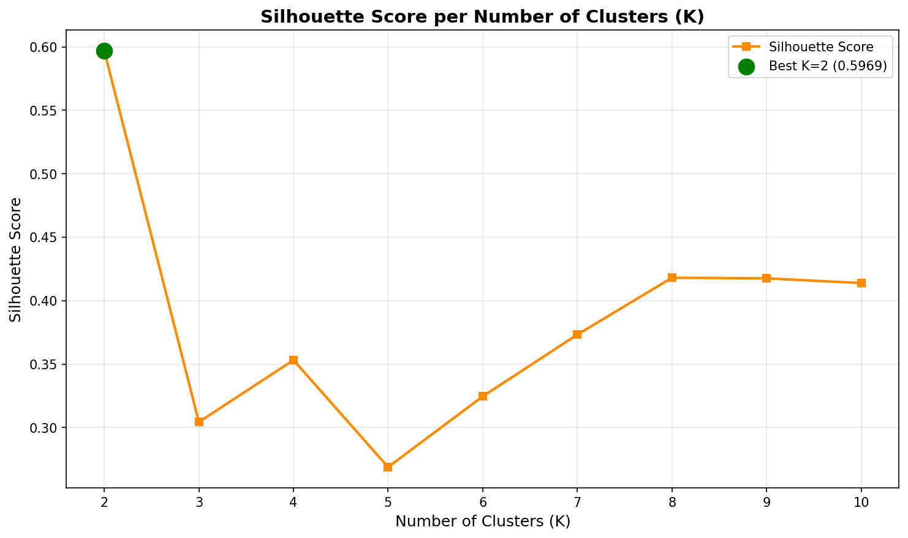

### 4. Analisis Silhouette per Sampel (K=8)
Visualisasi berbentuk pisau/sirip yang menunjukkan skor silhouette setiap sampel individual di dalam masing-masing dari 8 cluster. Garis putus-putus merah adalah rata-rata silhouette score (0.236).

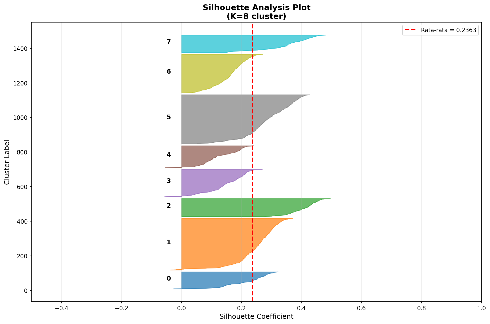

### 5. Principal Component Analysis (PCA) Scatter Plot 2D
Reduksi dimensi dari 112 fitur ke dalam 2 komponen utama (PC1 & PC2) untuk memvisualisasikan batas-batas cluster K-Means di ruang 2 dimensi.

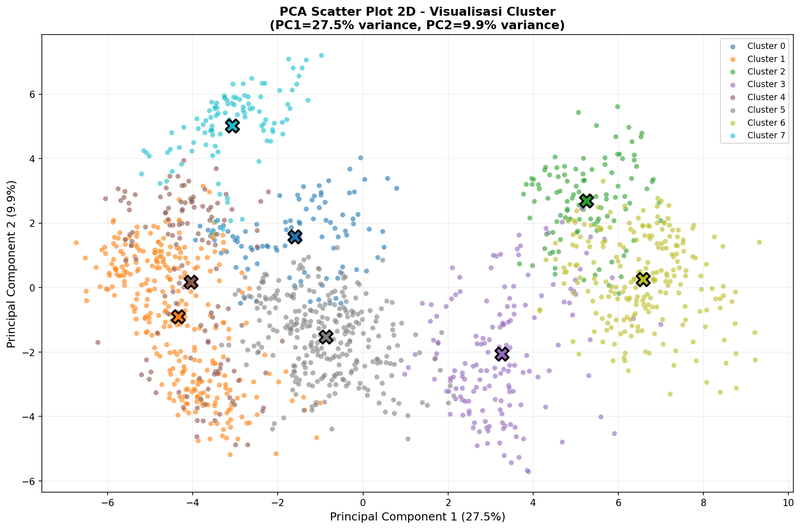

### 6. Radar Chart (Profil Rata-rata Fitur per Cluster)
Menunjukkan nilai rata-rata dari 10 fitur utama yang dinormalisasi untuk melihat karakteristik visual dari setiap cluster/kualitas.

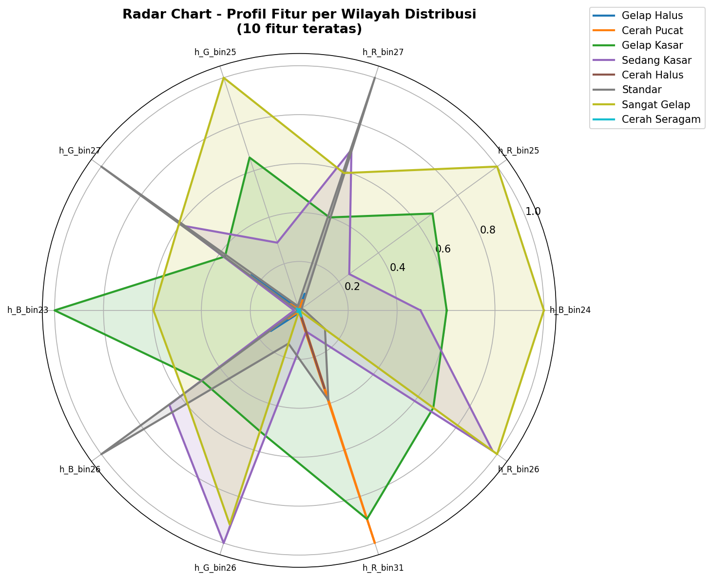

### 7. Pair Plot Scatter Matrix (Fitur Terpilih)
Hubungan sebaran silang (*cross-scatter*) dan KDE (diagonal) antara 5 fitur visual utama yang diwarnai berdasarkan label cluster.

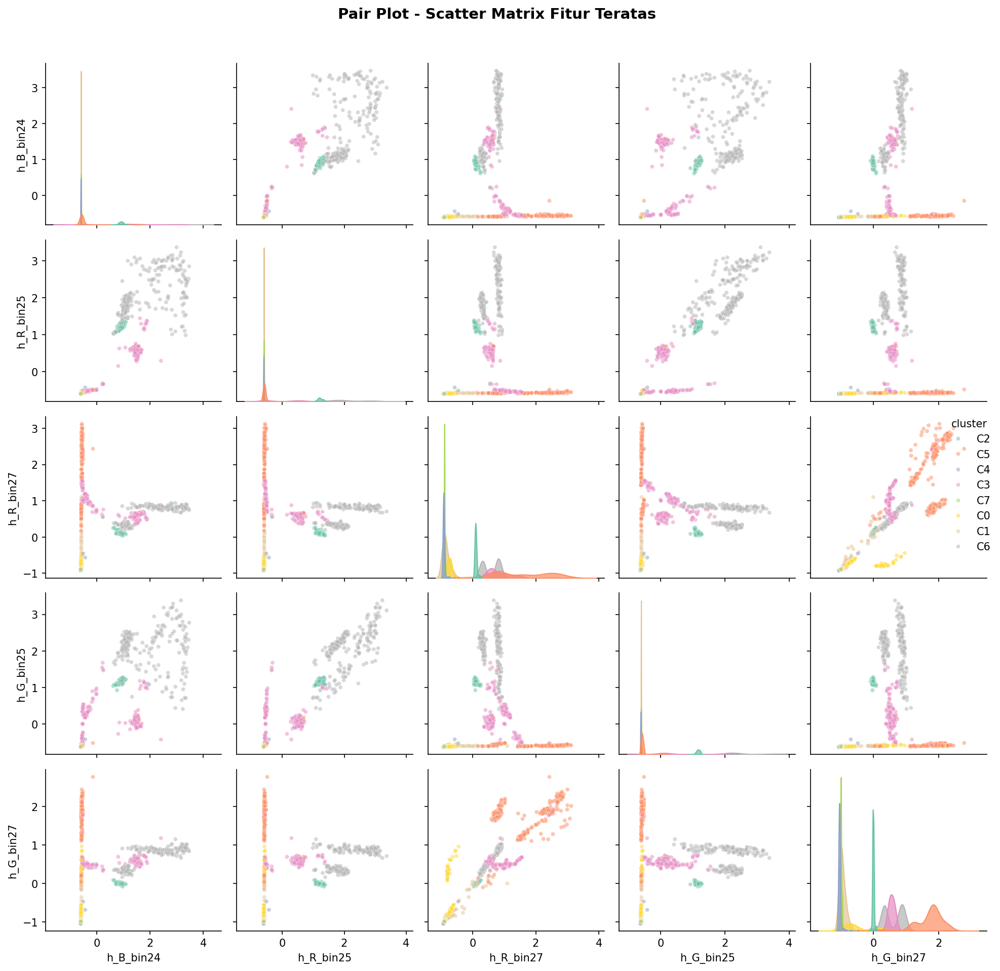

### 8. Heatmap Korelasi Fitur (Correlation Matrix)
Mengidentifikasi korelasi Pearson antara 20 fitur dengan varians tertinggi untuk melihat fitur mana saja yang memiliki informasi redundant.

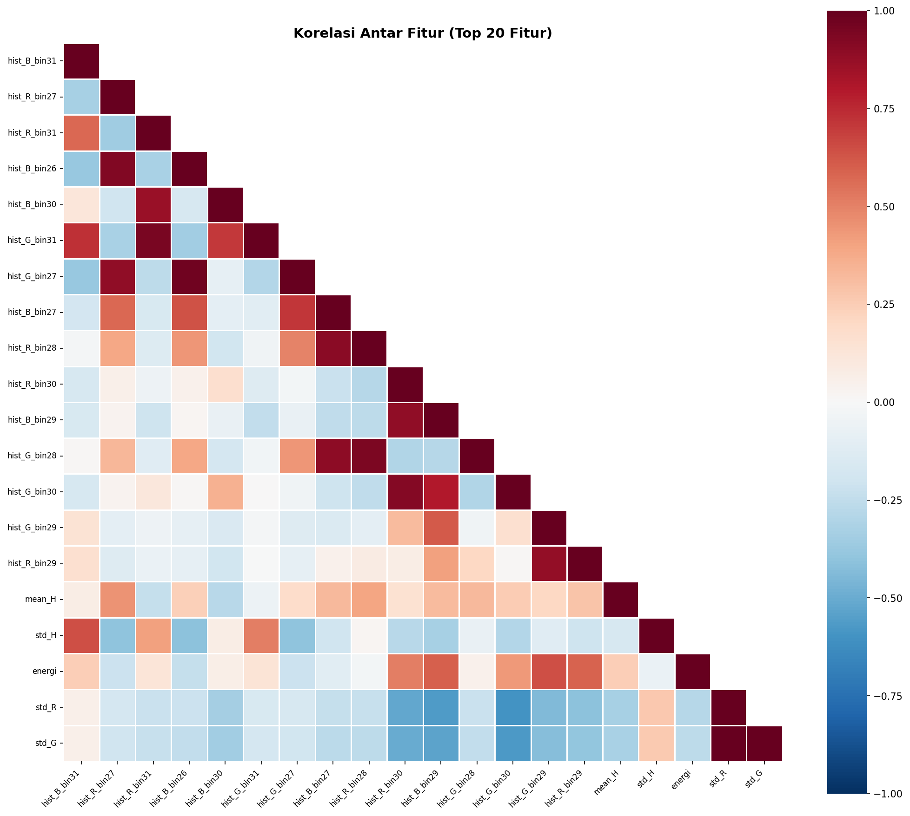

### 9. Distribusi Histogram RGB per Jenis Biji Kopi
Menampilkan sebaran kepadatan (*density*) warna channel Merah (R), Hijau (G), dan Biru (B) untuk membandingkan perbedaan warna varietas Arabika, Liberika, dan Robusta.

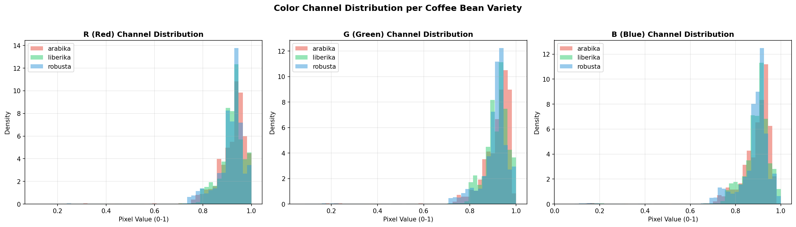

### 10. Distribusi Nilai Fitur (Boxplot per Cluster)
Boxplot sebaran nilai 6 fitur visual teratas di setiap cluster untuk mendeteksi varians data.

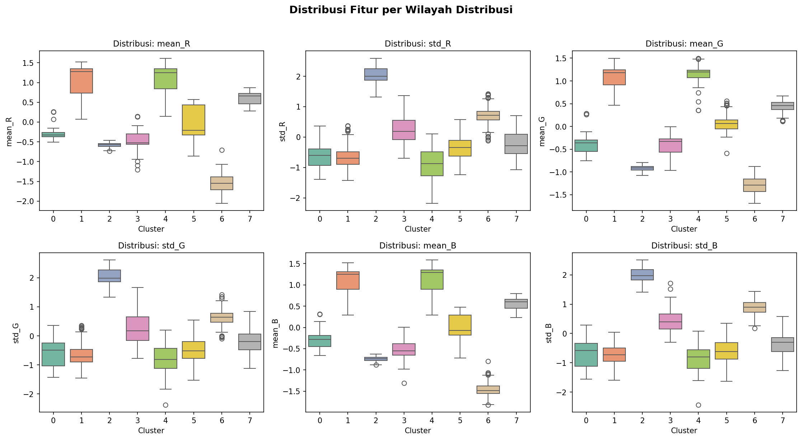

### 11. Confusion Matrix Klasifikasi Naive Bayes
Matriks evaluasi performa klasifikasi Naive Bayes dalam memprediksi kelas kualitas (0-7). Prediksi yang benar berkumpul di garis diagonal.

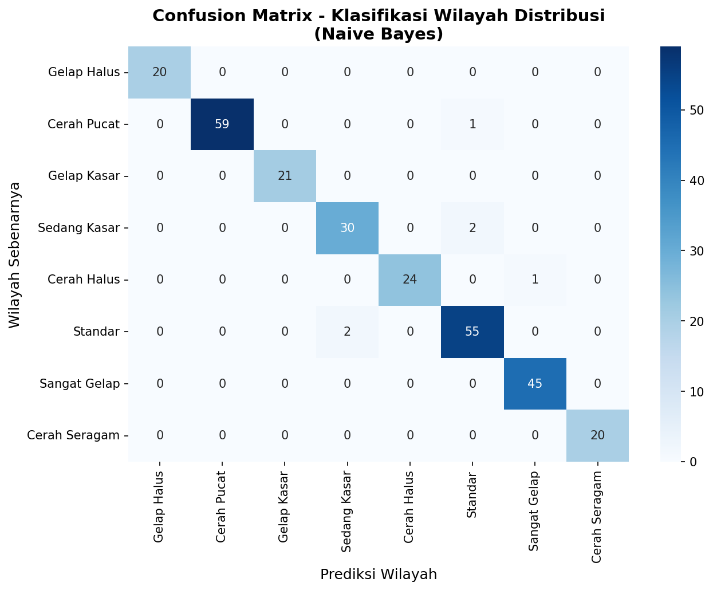

### 12. Metrik Evaluasi Per-Class (Precision, Recall, F1)
Menampilkan grafik batang performa model Naive Bayes (Precision, Recall, dan F1-Score) untuk masing-masing dari 8 kelas kualitas.

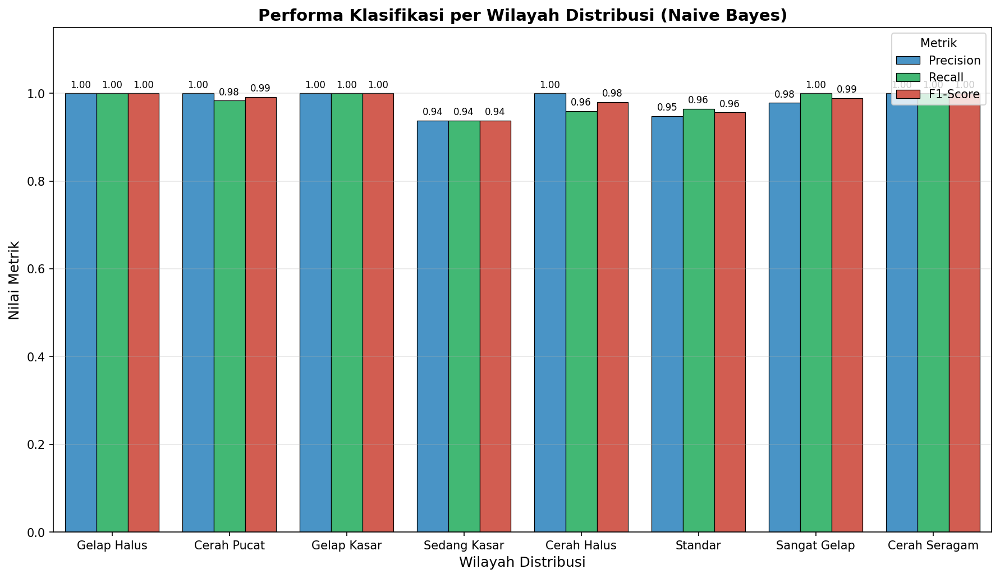

### 13. Perbandingan Metrik Evaluasi Keseluruhan
Perbandingan nilai rata-rata Akurasi, Presisi, Recall, dan F1-Score dari model Naive Bayes secara keseluruhan pada data uji.

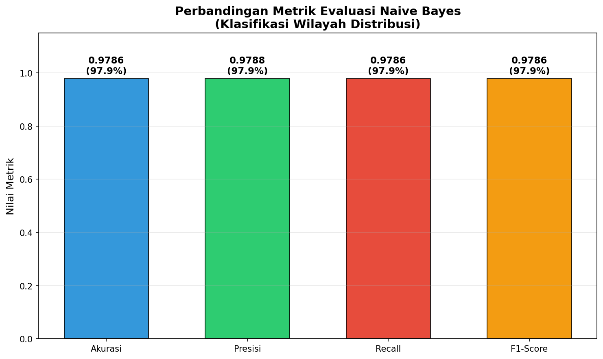

---

## 📈 Kinerja & Hasil Evaluasi Model

### K-Means Clustering (Pengelompokan Wilayah)
* **Jumlah Wilayah Optimal (K)**: 8 Cluster
* **Silhouette Score**: 0.2363
* **Inertia**: 41,250.30

### Naive Bayes Classification (Klasifikasi Kualitas)
* **Akurasi**: 97.86%
* **Presisi**: 97.88%
* **Recall (Sensitivitas)**: 97.86%
* **F1-Score**: 97.86%

---

## 🎮 Cara Menjalankan

### Pipeline Lengkap (Semua Tahap)
Jalankan entry point utama untuk mengekstrak fitur, melakukan clustering, melatih classifier, dan menyimpan visualisasi:
```bash
python main.py
```

### Batch Prediksi & Ekspor Excel
Gunakan `predict.py` untuk memproses seluruh dataset gambar sekaligus, kemudian menyimpan hasil prediksi model ke file Excel.
```bash
python predict.py all
```
Atau jalankan pada folder tertentu:
```bash
python predict.py dataset/raw/coffee_images/arabika
```
Untuk menentukan nama file hasil sendiri:
```bash
python predict.py all outputs/predictions.xlsx
```

### Mode Headless (Tanpa Tampilan Popup)
Jika Anda ingin menjalankan script di server tanpa menampilkan window popup GUI dari Matplotlib, ubah nilai berikut di `config.py`:
```python
SHOW_PLOTS = False  # Hanya menyimpan gambar ke folder outputs/plots/
```

---

## ⚖️ Lisensi
Proyek ini dilisensikan di bawah MIT License - bebas digunakan untuk kepentingan akademis, riset, dan pengembangan sistem klasifikasi komoditas pangan.
